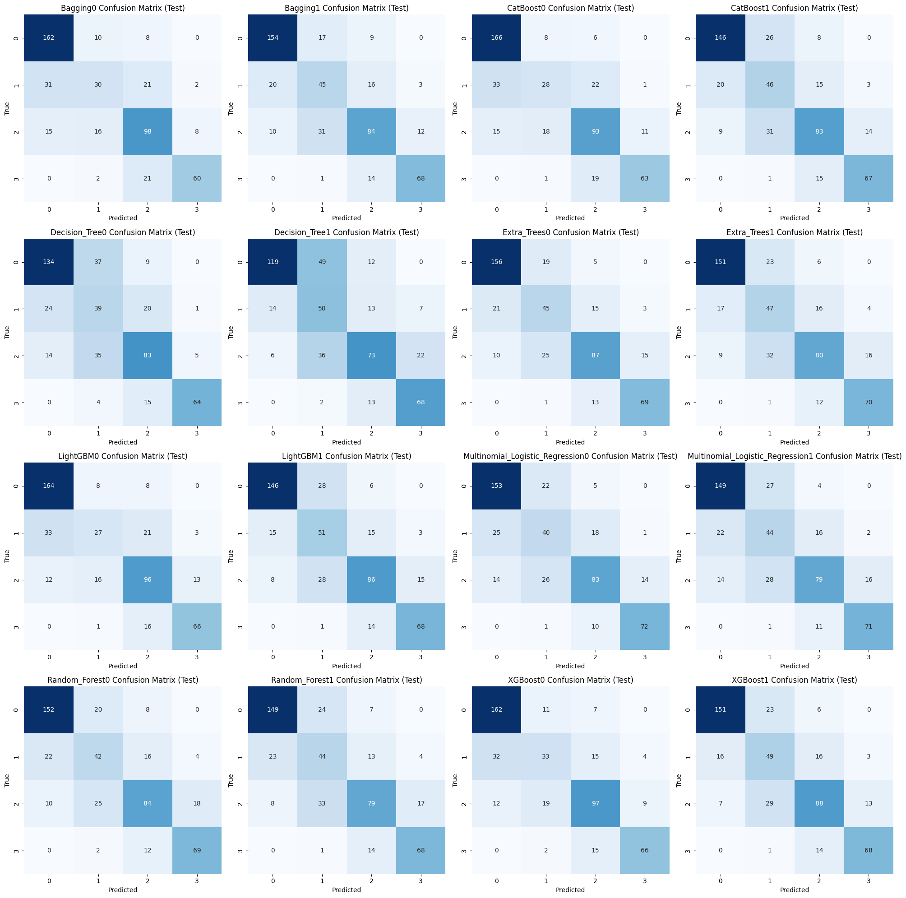

# CogniPredictAD
*Data Mining and Machine Learning, a.y. 2024/2025*

*Univeristy of Pisa,*
*Department of Information Engineering,*
*m.sc. Computer Engineering / m.sc. Artificial Intelligence and Data Engineering*

*Project by Francesco Panattoni*

This report introduces CogniPredictAD, a *Data Mining and Machine Learning* project designed to analyze clinical and biological parameters from the ADNI dataset, with the goal of predicting final clinical diagnoses (CN, EMCI, LMCI, AD) based on baseline data.
The analysis includes a detailed examination of preprocessing techniques: advanced missing data management, normalizations, and feature engineering. We assess the models based on their balanced accuracy and present the results through various evaluations.
Due to the ambiguity of the high predictivity of three values (CDRSB, LDELTOTAL, mPACCdigit), I build two families of models: with and without these features to reduce the risk of overfitting on ADNI.
The modeling phase includes Decision Tree, Random Forest, Extra Trees, XGBoost, LightGBM, CatBoost, Multinomial Logistic Regression, and Bagging. Hybrid sampling techniques, Grid Search for hyperparameter optimization, and cross-validation are applied. With the full set, the models achieve very high metrics (e.g., balanced accuracy ≈ 0.926, ROC-AUC ≈ 0.987), while by removing the three dominant features, the LightGBM with hybrid sampling retains the best balanced performance (balanced accuracy ≈ 0.721, ROC-AUC ≈ 0.907). For transparency, two optimized Decision Trees was also selected, and the trees and explanatory rules were saved.
The conclusions highlight good predictive performance on the ADNIMERGE dataset, but caution against possible sample bias and the need for external validation (by adding additional patients to the dataset or through data integration with similar datasets) before any clinical use.


## Data Acquisition
All data required are available through [ADNI](https://adni.loni.usc.edu/) and the Image and Data Archive provided by the [Laboratory of Neuro Imaging](https://www.loni.usc.edu/) at the University of Southern California. To obtain access to data from ADNI, see this link: http://adni.loni.usc.edu/data-samples/access-data/
After getting Data access from the Alzheimer's Disease Neuroimaging Initiative (ADNI), place the ADNIMERGE.csv file in the *data* folder.


## Installation
### With venv
```bash
cd CogniPredictAD
python -m venv CogniPredictAD
# On Linux/macOS:
source CogniPredictAD/bin/activate
# On Windows (PowerShell):
CogniPredictAD\Scripts\Activate.ps1
pip install --upgrade pip
pip install -e .
```

### With conda
```bash
cd CogniPredictAD
conda create --name CogniPredictAD python=3.11
conda activate CogniPredictAD
pip install --upgrade pip
pip install -e .
```

## Introduction
Early and accurate diagnosis of **Alzheimer’s disease** (AD) is a clinical and social priority: intervening before cognitive impairment becomes severe and allows for the planning of therapies, treatments, and support strategies, and the testing of interventions that slow decline. However, the disease is complex and multifactorial: clinical signs, cognitive tests, Cerebrospinal Fluid (CSF) biomarkers, genetics (e.g. APOE4), and neuroimaging measures interact in a nontrivial way. For this reason, **Machine Learning** (ML) techniques are particularly well-suited: they can integrate multimodal information, model nonlinear relationships, and identify combinations of features that improve the discrimination between **cognitively normal** (CN), **mild cognitive impairment** (MCI), and full-blown **Alzheimer’s subjects** (AD).

A dataset widely used in the literature for these purposes is **ADNI** (**Alzheimer’s Disease Neuroimaging Initiative**), a multicenter longitudinal study that collects clinical, cognitive, genetic, CSF, and imaging data from USA and Canada. In this project, I worked with the **ADNIMERGE.csv** tabular file, which is the merged version of the ADNI data and contains repeated visits over time, many clinical variables, biomarkers, and metadata. The notebooks show the entire process of building classification models and their employment.

In this project, baseline visits were selected (from 16,421 rows to 2,419 rows), extensive cleaning and imputation of missing features was performed, MRI volumes were normalized for ICV, and derived features (biological ratios and cognitive scores) were constructed. I divided the pipeline in two distinct sets with and without the three dominant cognitive features.

The modeling compared trees and ensembles, using hyperparameter optimization and sampling strategies. The **Random Forest** (with hybrid sampling) model was chosen as **Model1**. The **XGBoost** (with hybrid sampling) model, chosen as **Model2**, maintained good performance even when excluding the dominant features.

Furthermore, **XAIModel1** and **XAIModel2** represent the explainable Decision Trees for the dataset with and without the dominant features.


## Dataset
**ADNIMERGE.csv** is the **ADNI** merged table used as the main input in the notebooks: the copy used by the project contains 16,421 rows (representing visits) and 116 columns before any cleaning and selection, and incorporates repeat visits for each subject (VISCODE, EXAMDATE), identifiers (RID, PTID), and both the initial screening diagnosis (DX_bl) and the more complete diagnosis assigned at the visit (DX).

The structure is mixed but rich: there are demographics (AGE, PTGENDER, PTEDUCAT, PTETHCAT, PTRACCAT, PTMARRY), genetics (APOE4), numerous cognitive and clinical scores (MMSE, CDRSB, ADAS11/13, LDELTOTAL, FAQ, MOCA, TRABSCOR, RAVLT\_…, mPACC…), CSF and PET biomarkers (ABETA, TAU, PTAU, FDG, also columns such as PIB and AV45), and MRI volumetric measures (Ventricles, Hippocampus, Entorhinal, Fusiform, MidTemp, WholeBrain, ICV). Some features are related to a single visit, while others are repeated but refer to measurements taken during the baseline visit and end with the suffix "\_bl".

*ADNIMERGE.csv*, however, isn’t simply a concatenation: many variables are derived from source files. For example, the variable Hippocampus is derived from the sum of the left/right components (ST29SV + ST88SV) taken from the original *FreeSurfer* files.


## Multiclass Problem
As I have seen, we have a different class distribution between DX_bl and DX.
- **DX_bl** can be "CN", "SMC", "EMCI", "LMCI", and "AD". It indicates the screening diagnosis, i.e. the preliminary clinical judgment assigned during the first evaluation visit. It is a Screening diagnosis.
- **DX** can be "CN", "MCI", and "Dementia". It is instead the diagnosis assigned during the baseline visit (denoted by *VISCODE* equal to "bl"), after a more in-depth clinical evaluation.

"AD" and "Dementia" are the same thing despite the different names.

The acronym **SMC** refers to *Subjective Memory Concern*, i.e., cognitively normal (CN) subjects reporting perceived memory issues. Since predicting a subjective perception from objective data is not meaningful. So I reassign it based on the value it has in DX.

Furthermore, we divide MCI into EMCI (Early MCI) and LMCI (Late MCI), assuming that DX_bl values accurately distinguish EMCI and LMCI when DX equals MCI. This is because the division into EMCI and LMCI reflects the degree of cognitive impairment and the risk of progression to dementia.
- **EMCI:** mild cognitive deficits, often detectable only with more sensitive tests. Lower or slower risk of progression to dementia.
- **LMCI:** more marked and evident impairment, greater impact on daily life. Higher risk of progression to Alzheimer’s or other dementias.

Therefore, we decide to keep them in the diagnostic prediction.

<figure id="fig:pie-chart-dx" data-latex-placement="H">
<p>
<span id="fig:pie-chart-dx" data-label="fig:pie-chart-dx"></span></p>
</figure>

**Ultimately, our target variable will be a modified version of the *DX* column, which can now take on four values: "CN", "EMCI", "LMCI", and "AD." This makes our problem a multiclass problem.**


## Data Exploration
Explorations reveal that the dataset has 16,421 rows and 116 columns. However, these records represent the various visits, and we are only interested in the baseline ones. The dataset contains 2,419 useful patients (using "useful" means those who did not have a NULL baseline diagnosis) for the proposed problem.

Many columns contain significant percentages of missing cases. The diagnostic classes of the baseline sample are unbalanced, but not extremely unbalanced.

Demographic and risk analyses show bias in the ADNI sample. Ethnicity is heavily skewed toward white subjects, with high average levels of education, and many married individuals. There are more men than women, but overall the number is not disproportionate. All this, however, implies that models may perform worse on more heterogeneous clinical populations.

The *Data Exploration* was then divided into three parts:
1.  the preliminary data exploration of the raw dataset;
2.  the data exploration after splitting and preparing the actual dataset;
3.  the data exploration after Preprocessing to select the classification models.


## Data Preprocessing
We divided the *Preprocessing* into two phases.

In the first phase, which involved preparing the dataset, we performed all the transformations and cleaning operations that did not involve the risk of *data leakage*, applying them to the entire dataset before splitting it into training and testing.

In the second phase, however, we applied the transformations that could introduce data leakage exclusively to the training set, with the sole exception of imputing missing values: in this case, the *KNN* Imputer was trained on the training set and then used for both training and testing, to ensure consistency and avoid leakage. Preprocessing has in turn been divided into: *Data Cleaning*, *Data Transformation*, *Outlier Detection* and *Data Reduction*.

### Data Preparation
- **Selection of baseline visits only:** The first clinical-operational choice was to work only on baseline visits (VISCODE == "bl"), because the goal is to predict the diagnosis based on the information collected at the first visit;
- **SMC diagnosis management:** Records with *DX_bl* = SMC were realigned using the DX variable, but ultimately all have been classified as "CN". We already explained why in the reasons stated in the chapter "Multiclass Problem";
- **Consolidating bl columns:** Clean up duplicates and merge "baseline" values into "main" columns;
- **Error handling:** Deleted the row with RAVLT_perc_forgetting = -316.667 and RAVLT_forgetting = -19;
- **Text category cleaning (ethnicity, race, marriage):** String values standardized to improve readability and avoid inconsistencies;
- **Encoding of categorical variables:** One-hot encoding (PTETHCAT, PTMARRY), binary mapping (PTGENDER: Male=1, Female=0) and ordinal encoding for DX (CN=0, EMCI=1, LMCI=2, AD=3).
- **Preliminary Feature Reduction:** Removal of columns not relevant to the diagnosis;
- **Splitting train/test:** *Separation into training and test sets while avoiding leakage.*

### Data Cleaning
- **Handling missing values:** Identifying percentages of missing values and using KNN Imputer for continuous variables ;
- **Numeric Value Conversion:** Convert cognitive scales and age from float to int, correcting for approximations due to imputation or format errors.

### Data Transformation
- **Creation of new CSF metrics:** *TAU/ABETA* and *PTAU/ABETA* ratios more predictive than single measures according to the literature;
- **MRI normalization to ICV (Intracranial Volume):** Necessary to correct for differences due to gender and cranial size.

### Outlier Detection
- **Univariate Analysis:** use IQR and Z-score for each column to find outliers;
- **Multivariate Analysis:** Constructs groups (EcogPt, EcogSP, Neuropsych, MRI, MRI/ICV, CSF, CSF/ABETA, mPACC), applies *LOF* and *DBSCAN* to normalized data (*RobustScaler*). Only data points reported by both techniques and with a *LOF_score* greater than 2 are kept to flag them as "extreme";
- **Cleaning up problematic outliers:** Outliers with values that were clearly out of range and therefore deemed highly unlikely were replaced with the mean by class.

### Data Reduction
- **Removal of redundant features:** *ADAS11*, *ADASQ4*, *EcogPtTotal*, *EcogSPTotal*, *mPACCtrailsB*, and *TAU* were removed because they had a high correlation with other features and their informative value was low;
- **Attribute Subset Selection:** I apply four selection methods to the train: *Pearson correlation* (\|*r*\| ≥ 0.6), *mutual information* (top 25), *SelectKBest with Kruskal–Wallis H-test* (*k* = 25), and *Recursive Feature Elimination* (RFE with Random Forest). It combines the results by counting how many times each feature appears and retains those selected at least three times, plus other features deemed useful even though they were counted less frequently.

### Some Considerations
#### Correlation
The dataset contains groups of highly correlated variables (e.g., different neuropsychological scores, ECG components, and MRI volumetric measurements). Rather than eliminating them through aggressive reduction, I decided to retain them and rely on models that are intrinsically robust to correlation.
This choice was motivated by two main reasons:
1.  **Clinical interpretability:** Correlated variables can describe different facets of the same function or biomarker. Removing them would impoverish medical interpretation;
2.  **Complementary predictive value:** Even correlated measures may contain specific variance useful for distinguishing clinical subgroups.

#### Normalization
During the data preparation process, no global normalization or standardization was applied to all variables.
This choice was driven by one reason: I wanted to **preserve the clinical interpretability**. Maintaining variables in their original units facilitates the medical interpretation of the results and comparability with clinical reference values. Normalization would have made it more difficult to attribute direct clinical significance to the transformed values.

#### Binning
Binning was not applied because it would have reduced the useful information and discriminatory power of continuous variables. The models used already capture nonlinearities and thresholds, so prior discretization is unnecessary and could introduce artifacts.

#### Attributes Table
| **Attribute** | **Description** | **Category** |
|:---|:---|:---|
| DX | Clinical diagnosis at the time of visit: CN, SMC, EMCI, LMCI, AD | Diagnosis |
| AGE | Participant’s age at time of visit | Demographics |
| PTGENDER | Participant’s gender (Male/Female) | Demographics |
| PTEDUCAT | Years of formal education completed | Demographics |
| APOE4 | Number of APOE *ε*<!-- -->4 alleles (0, 1, or 2), a genetic risk factor for Alzheimer’s | Demographics |
| MMSE | Mini-Mental State Examination score (0–30, higher = better) | Clinical Scores |
| CDRSB | Clinical Dementia Rating - Sum of Boxes (0–18, higher = worse) | Clinical Scores |
| ADAS13 | ADAS-Cog 13-item total score (higher = worse) | Clinical Scores |
| LDELTOTAL | Logical Memory II delayed recall total score | Clinical Scores |
| FAQ | Functional Activities Questionnaire – functional impairment score | Clinical Scores |
| MOCA | Montreal Cognitive Assessment – global cognitive function (0–30) | Clinical Scores |
| TRABSCOR | Trail Making Test Part B – time in seconds (higher = worse) | Clinical Scores |
| RAVLT_immediate | RAVLT total immediate recall score (sum over 5 trials) | Clinical Scores |
| RAVLT_learning | Learning score (Trial 5 minus Trial 1 of RAVLT) | Clinical Scores |
| RAVLT_perc_forgetting |   Percent forgetting from RAVLT (higher = worse) | Clinical Scores |
| mPACCdigit | Modified Preclinical Alzheimer’s Cognitive Composite – Digit Symbol test | Composite Scores |
| EcogPtMem | Subject self-reported memory complaints (ECog) | ECogPT |
| EcogPtLang | Subject self-reported language difficulties (ECog) | ECogPT |
| EcogPtVisspat | Subject self-reported visuospatial difficulties (ECog) | ECogPT |
| EcogPtPlan | Subject self-reported planning difficulties (ECog) | ECogPT |
| EcogPtOrgan | Subject self-reported organizational issues (ECog) | ECogPT |
| EcogPtDivatt | Subject self-reported divided attention issues (ECog) | ECogPT |
| EcogSPMem | Informant-reported memory complaints (ECog) | ECogSP |
| EcogSPLang | Informant-reported language issues (ECog) | ECogSP |
| EcogSPVisspat | Informant-reported visuospatial issues (ECog) | ECogSP |
| EcogSPPlan | Informant-reported planning problems (ECog) | ECogSP |
| EcogSPOrgan | Informant-reported organization issues (ECog) | ECogSP |
| EcogSPDivatt | Informant-reported divided attention issues (ECog) | ECogSP |
| FDG | FDG PET SUVR – brain glucose metabolism | Biomarkers |
| PTAU/ABETA | CSF phosphorylated tau protein/A*β*<!-- -->42 ratio | Biomarkers |
| Hippocampus/ICV | Volume of hippocampus/Intracranial volume ratio from MRI | MRI |
| Entorhinal/ICV | Volume of the entorhinal cortex/Intracranial volume ratio from MRI | MRI |
| Fusiform/ICV | Fusiform gyrus volume/Intracranial volume ratio from MRI | MRI |
| MidTemp/ICV | Middle temporal gyrus volume/Intracranial volume ratio from MRI | MRI |
| Ventricles/ICV | Volume of ventricles/Intracranial volume ratio from MRI | MRI |
| WholeBrain/ICV | Whole brain volume/Intracranial volume ratio from MRI | MRI |

## Model Selection
The following classification algorithms were chosen:
1.  **Decision Tree:** This model constructs a series of "if → then" rules (split on individual features) to separate classes using a binary tree. Each leaf of the tree corresponds to a prediction. It was chosen because it is immediately interpretable (*XAI*);
2.  **Random Forest:** Builds many different decision trees on subsamples of the data and averages their predictions. This reduces variance compared to a single tree and improves robustness to noise, outliers, and collinearity;
3.  **Extra Trees:** Similar to Random Forest but chooses more random splits, increasing diversity among trees and often reducing overfitting on noisy features. It was tested to compare with Random Forest and evaluate whether increased randomness improved generalization across the dataset;
4.  **XGBoost:** A boosting algorithm that builds trees sequentially, each improving the errors of the previous one. It is highly efficient, regularized, and capable of capturing nonlinear interactions between variables, while also controlling overfitting;
5.  **LightGBM:** A gradient boosting implementation designed to be very fast and scalable. It uses techniques (leaf-wise splitting, binning) that make it particularly efficient on heterogeneous datasets;
6.  **CatBoost:** A boosting variant that natively handles categorical variables and has robust default hyperparameters to reduce overfitting. It is suitable for working with clinical data;
7.  **Multinomial Logistic Regression:** A linear model that estimates the probabilities of membership in each class using a linear combination of features. It requires feature standardization to function properly, which was ensured with StandardScaler in the pipeline. It was included as a simple and interpretable statistical baseline, useful for comparing whether the gain from complex models is consistent with a linear solution;
8.  **Bagging:** An ensemble approach that trains several models on different bootstrap samples drawn from the dataset, and then combines their outputs by averaging. The main effect is a reduction in model variance, leading to more stable predictions. It was selected because, in clinical datasets where variability and noise are substantial, bagging provides a straightforward way to assess how much predictive stability can be gained simply by aggregating multiple weak learners.


## Hyperparameter Selection and Hybrid Sampling
### Grid Search
To optimize the performance of the classifiers, a **Grid Search** procedure with layered cross-validation was adopted. Grid Search was chosen because it allows for a systematic and controlled exploration of the most relevant hyperparameters for each model, ensuring reproducibility and the ability to transparently compare the tested configurations.

### Hybrid Sampling
The dataset also presented a slight imbalance in diagnostic classes, as already discussed in the "Multiclass Problem" chapter.

To address this problem, a **Hybrid Sampling strategy** was applied, combining:

1.  **RUS** to reduce the number of instances in the majority classes, preventing the dataset from becoming excessively biased toward synthetic examples;

2.  **SMOTENC** to generate new synthetic examples of the minority classes, taking into account the mixed nature of the variables (continuous and categorical).

I kept the "old" dataset (the one obtained with Preprocessing) and the "new" one (the resampled one) and tried Hyperparameter Tuning on both.

### The problem with CDRSB, LDELTOTAL, and mPACCdigit
The cognitive scores *CDRSB*, *LDELTOTAL* and *mPACCdigit* show exceptionally high predictive power compared to the rest. While this may be advantageous in terms of model accuracy, it also raises the concern of feature dominance: **a small number of variables may disproportionately drive the predictions, while many others contribute minimally**. This imbalance can lead to a form of local overfitting, where **models appear highly effective on the ADNI dataset but lose performance when applied to more heterogeneous clinical populations or external data.**

**However, this assumption cannot be verified, as it is equally possible that these three variables are genuine strong predictors of Alzheimer’s diagnosis.**

So the issue does not reflect a weakness of the cognitive measures themselves, but rather the possibility of dataset bias: the strength of these predictors may be tied to the specific characteristics of ADNI rather than to generalizable diagnostic patterns.

To address this, the modeling strategy should consider two complementary approaches:

1.  building a predictive model that leverages these dominant variables;

2.  building an alternative model that excludes them.

Hybrid Sampling will be applied to both datasets and then I will compare whether the standard models or the resampled models performs better on the test set.

### Hyperparameter Optimization
In practice, I will end up with two models: one that can also use CDRSB, LDELTOTAL, and mPACCdigit, chosen from the standard and resampled models, and one that doesn’t use CDRSB, LDELTOTAL, and mPACCdigit, chosen from the standard and resampled models.

Therefore, I need to run four Grid Searches. For each model, a large set of hyperparameter configurations was defined to explore, often with thousands of possible combinations. Optimization was conducted through five-fold cross-validation, with different metrics depending on the scenario: *F1 Macro* when the most predictive variables were present, *Balanced Accuracy* in the most restrictive experiments, and *F1 Macro*.

*F1 Macro* assigns equal weight to each class and simultaneously punishes low precision or low recall. It is therefore suitable when a few strong features can "inflate" the accuracy without ensuring fairness between classes.

*Balanced Accuracy* is insensitive to prevalence and less dependent on precision. In the absence of dominant features, it directs the optimization to correctly retrieve all classes.

At the end of the Grid Search, the optimal parameters found for each model were used to instantiate the “final” versions of the classifiers and produce subsequent evaluations.


## Classification
### Building Models
From the Grid Search, the best estimators, their parameters, and scores were collected for each model. These best-estimators were saved and then retrained and evaluated via 5-fold cross-validation, which produced several reports (confusion matrices, per-class metrics, accuracy, balanced accuracy, and ROC-AUC) and repeated evaluations for stability.

So we built four models for each algorithm seen before: one unsampled with the three feature, one sampled with the three feature, one unsampled without the three feature and one sampled without the three feature.

### Explainability
A method is called to generate *SHAP* summary plots on each model.

**The three clinical scores dominate the explanations when present**.
SHAP plots calculated on models trained on the version with CDRSB, LDELTOTAL, and mPACCdigit clearly show that these three variables are the most important in absolute terms, far above the other features. The SHAP summary plots also highlight that the direction of the effect is consistent i.e., worse values for these scores bias the prediction toward more severe classes.

**When the three scores are removed**, biomarkers, demographics, and structural measures emerge.
In the graphs produced on the version without those three scores, the feature ranking changes: **MMSE, FAQ, MOCA, ADAS13, and EcogSPMem become extremely relevant**. Also relevant are CSF (TAU/ABETA or PTAU/ABETA ratio), APOE4, and some MRI measures normalized for ICV (e.g., Hippocampus/ICV, Ventricles/ICV, WholeBrain/ICV).

The tree diagrams and exported rule files highlight that Decision Trees separate classes using thresholds on a few features (often one of the three clinical scores when present, otherwise a combination of biomarkers and cognitive tests).

The rules are therefore easily interpretable and useful for communicating "if → then" statements to clinical staff.

The balancing effect (*hybrid sampling*) is visible in the importances and local explanations.
Comparing the plots for models with and without hybrid sampling shows a modest change in the ranking: **sampling tends to increase the relative importance of features that help identify less represented classes**.

### Results
We evaluated the newly built models on the train dataset, on 5-fold-cross validation and on test dataset. However, for the final evaluation I mainly relied on the explainability and the results of the test set through the following statistics: *Balanced Accuracy, F1 Score (macro), Accuracy, Precision (weighted), Recall (weighted), F1 Score (weighted), and ROC AUC (macro)*. The evaluation plots and confusion matrices are on the following pages, included with the evaluation tables of the statistics on the test dataset.

The following pages contain the graphs and tables that led to the final evaluation.

**The models ending with 1 were trained on the dataset with Hybrid Sampling, while those ending with 0 were not.**

**Although the models with CDRSB, LDELTOTAL, and mPACCdigit and those without CDRSB, LDELTOTAL, and mPACCdigit have the same names (e.g., XGBoost0, XGBoost1, ExtraTrees0, RandomForest1, and so on), they are actually distinct models born from distinct classifiers. Models with CDRSB, LDELTOTAL, and mPACCdigit are in the "results/all_models/1" folder, and those without are in the  
"results/all_models/2" folder.**

<figure id="fig:Evaluation with CDRSB, LDELTOTAL, and mPACCdigit" data-latex-placement="H">
<p>
<span id="fig:Evaluation with CDRSB, LDELTOTAL, and mPACCdigit" data-label="fig:Evaluation with CDRSB, LDELTOTAL, and mPACCdigit"></span></p>
<figcaption>Evaluation of Balanced Accuracies with CDRSB, LDELTOTAL, and mPACCdigit (from folder results/all_models/1)</figcaption>
</figure>

<figure id="fig:Evaluation without CDRSB, LDELTOTAL, and mPACCdigit" data-latex-placement="H">
<p>
<span id="fig:Evaluation without CDRSB, LDELTOTAL, and mPACCdigit" data-label="fig:Evaluation without CDRSB, LDELTOTAL, and mPACCdigit"></span></p>
<figcaption>Evaluation of Balanced Accuracies without CDRSB, LDELTOTAL, and mPACCdigit (from folder results/all_models/2)</figcaption>
</figure>

<figure id="fig:Confusion Matrix with CDRSB, LDELTOTAL, and mPACCdigit" data-latex-placement="H">
<p>
<span id="fig:Confusion Matrix with CDRSB, LDELTOTAL, and mPACCdigit" data-label="fig:Confusion Matrix with CDRSB, LDELTOTAL, and mPACCdigit"></span></p>
<figcaption>Confusion Matrix with CDRSB, LDELTOTAL, and mPACCdigit (from folder results/all_models/1)</figcaption>
</figure>

<figure id="fig:Normalized Confusion Matrix with CDRSB, LDELTOTAL, and mPACCdigit" data-latex-placement="H">
<p>
<span id="fig:Normalized Confusion Matrix with CDRSB, LDELTOTAL, and mPACCdigit" data-label="fig:Normalized Confusion Matrix with CDRSB, LDELTOTAL, and mPACCdigit"></span></p>
<figcaption>Normalized Confusion Matrix with CDRSB, LDELTOTAL, and mPACCdigit (from folder results/all_models/1)</figcaption>
</figure>

<figure id="fig:Confusion Matrix without CDRSB, LDELTOTAL, and mPACCdigit" data-latex-placement="H">
<p>
<span id="fig:Confusion Matrix without CDRSB, LDELTOTAL, and mPACCdigit" data-label="fig:Confusion Matrix without CDRSB, LDELTOTAL, and mPACCdigit"></span></p>
<figcaption>Confusion Matrix without CDRSB, LDELTOTAL, and mPACCdigit (from folder results/all_models/2)</figcaption>
</figure>

<figure id="fig:Normalized Confusion Matrix without CDRSB, LDELTOTAL, and mPACCdigit" data-latex-placement="H">
<p>
<span id="fig:Normalized Confusion Matrix without CDRSB, LDELTOTAL, and mPACCdigit" data-label="fig:Normalized Confusion Matrix without CDRSB, LDELTOTAL, and mPACCdigit"></span></p>
<figcaption>Normalized Confusion Matrix without CDRSB, LDELTOTAL, and mPACCdigit (from folder results/all_models/2)</figcaption>
</figure>

*M_L_R is for Multinomial_Logistic_Regression.*

**With CDRSB, LDELTOTAL, and mPACCdigit (from folder results/all_models/1)**
| Model           | Accuracy | Balanced Accuracy | Precision (weighted) | Recall (weighted) | F1 Score (weighted) | F1 Score (macro) | ROC AUC (macro) |
| --------------- | -------- | ----------------- | -------------------- | ----------------- | ------------------- | ---------------- | --------------- |
| Random\_Forest1 | 0.9256   | 0.9198            | 0.9271               | 0.9256            | 0.9258              | 0.9169           | 0.9865          |
| Extra\_Trees1   | 0.9236   | 0.9188            | 0.9250               | 0.9236            | 0.9240              | 0.9143           | 0.9862          |
| XGBoost0        | 0.9277   | 0.9168            | 0.9284               | 0.9277            | 0.9275              | 0.9180           | 0.9876          |
| Random\_Forest0 | 0.9298   | 0.9163            | 0.9310               | 0.9298            | 0.9294              | 0.9205           | 0.9839          |
| XGBoost1        | 0.9236   | 0.9153            | 0.9244               | 0.9236            | 0.9237              | 0.9138           | 0.9868          |
| Extra\_Trees0   | 0.9236   | 0.9132            | 0.9240               | 0.9236            | 0.9236              | 0.9136           | 0.9884          |
| CatBoost1       | 0.9194   | 0.9128            | 0.9205               | 0.9194            | 0.9197              | 0.9102           | 0.9875          |
| LightGBM1       | 0.9194   | 0.9116            | 0.9202               | 0.9194            | 0.9195              | 0.9095           | 0.9871          |
| CatBoost0       | 0.9215   | 0.9090            | 0.9219               | 0.9215            | 0.9212              | 0.9108           | 0.9887          |
| LightGBM0       | 0.9194   | 0.9048            | 0.9207               | 0.9194            | 0.9189              | 0.9075           | 0.9843          |
| Bagging0        | 0.9194   | 0.9041            | 0.9224               | 0.9194            | 0.9192              | 0.9079           | 0.9844          |
| Bagging1        | 0.9050   | 0.8953            | 0.9062               | 0.9050            | 0.9053              | 0.8930           | 0.9835          |
| Decision\_Tree1 | 0.8988   | 0.8930            | 0.9015               | 0.8988            | 0.8995              | 0.8862           | 0.9803          |
| M\_L\_R1        | 0.8781   | 0.8731            | 0.8831               | 0.8781            | 0.8785              | 0.8629           | 0.9806          |
| Decision\_Tree0 | 0.8760   | 0.8722            | 0.8813               | 0.8760            | 0.8771              | 0.8615           | 0.9746          |
| M\_L\_R0        | 0.8740   | 0.8720            | 0.8811               | 0.8740            | 0.8748              | 0.8598           | 0.9815          |


**Without CDRSB, LDELTOTAL, and mPACCdigit (from folder results/all_models/2)**
| Model           | Accuracy | Balanced Accuracy | Precision (weighted) | Recall (weighted) | F1 Score (weighted) | F1 Score (macro) | ROC AUC (macro) |
| --------------- | -------- | ----------------- | -------------------- | ----------------- | ------------------- | ---------------- | --------------- |
| XGBoost1        | 0.7355   | 0.7210            | 0.7458               | 0.7355            | 0.7392              | 0.7172           | 0.9071          |
| Extra\_Trees0   | 0.7376   | 0.7172            | 0.7383               | 0.7376            | 0.7368              | 0.7140           | 0.9093          |
| LightGBM1       | 0.7252   | 0.7163            | 0.7400               | 0.7252            | 0.7301              | 0.7098           | 0.9081          |
| Extra\_Trees1   | 0.7190   | 0.7064            | 0.7285               | 0.7190            | 0.7211              | 0.6988           | 0.9068          |
| Bagging1        | 0.7252   | 0.7059            | 0.7282               | 0.7252            | 0.7258              | 0.7043           | 0.9038          |
| M\_L\_R0        | 0.7190   | 0.6999            | 0.7188               | 0.7190            | 0.7172              | 0.6970           | 0.9071          |
| XGBoost0        | 0.7397   | 0.6990            | 0.7287               | 0.7397            | 0.7314              | 0.7033           | 0.9126          |
| Random\_Forest0 | 0.7169   | 0.6972            | 0.7173               | 0.7169            | 0.7159              | 0.6919           | 0.9053          |
| M\_L\_R1        | 0.7087   | 0.6959            | 0.7160               | 0.7087            | 0.7093              | 0.6900           | 0.9037          |
| CatBoost1       | 0.7066   | 0.6930            | 0.7180               | 0.7066            | 0.7106              | 0.6894           | 0.9092          |
| Random\_Forest1 | 0.7025   | 0.6869            | 0.7116               | 0.7025            | 0.7045              | 0.6809           | 0.9040          |
| LightGBM0       | 0.7293   | 0.6821            | 0.7127               | 0.7293            | 0.7152              | 0.6827           | 0.9123          |
| Bagging0        | 0.7231   | 0.6738            | 0.7138               | 0.7231            | 0.7131              | 0.6824           | 0.9040          |
| CatBoost0       | 0.7231   | 0.6734            | 0.7089               | 0.7231            | 0.7101              | 0.6786           | 0.9093          |
| Decision\_Tree1 | 0.6405   | 0.6521            | 0.6881               | 0.6405            | 0.6522              | 0.6357           | 0.8567          |
| Decision\_Tree0 | 0.6612   | 0.6464            | 0.6904               | 0.6612            | 0.6726              | 0.6547           | 0.8380          |


### Final Decision
For the dataset containing the three highly predictive cognitive scores (CDRSB, LDELTOTAL, mPACCdigit), ***Random_Forest1*** (**the RF trained with the hybrid sampling strategy**) was chosen as the main model, and ***Decision_Tree1*** (**the version with sampling**) was chosen as the reference XAI model. This choice is motivated by very high test metrics (balanced accuracy, F1, ROC-AUC) that show the best sensitive tradeoff between classes.
**Model1.pkl and XAIModel1.pkl are respectively Random_Forest1 and Decision_Tree1.**

For the dataset where those three cognitive scores were removed, the model that maintained the best performance was ***XGBoost1*** (XGBoost with hybrid sampling), and, again, ***Decision_Tree1*** was chosen as the XAIModel (the version built on the dataset without the three scores). This selection also comes from comparing the metrics on the test set.
**Model2.pkl and XAIModel2.pkl are respectively XGBoost1 and Decision_Tree1.**

## Conclusions
### Real World Applications
A CogniPredictAD application (in main.py) has been developed with customtkinter that allows you to select one of four previously saved models (Model1.pkl, Model2.pkl, XAIModel1.pkl, and XAIModel2.pkl), manually enter a set of clinical and cognitive measures, obtain a diagnostic prediction (labels 0, 1, 2, or 3 for CN, EMCI, LMCI, and AD, respectively), and display it. The user can confirm or dispute the diagnosis: both actions add a line to the data/NEWADNIMERGE.csv file (creating a folder/file if necessary), while an “Undo Last” command cancels the last saved entry. This application can be used by clinicians to collect data, evaluate prediction models, and ultimately help establish a diagnosis.

### Final Considerations
One of the main limitations of the dataset is that, after filtering for baseline visits with non-zero diagnoses, only 2,419 patients remain, a size that limits the ability to generalize the results to external populations. While these metrics showed very high performance on the test set (for Model 1: Balanced Accuracy = 0.9198, F1 macro = 0.9169, ROC AUC (macro) = 0.9865), these metrics should be interpreted with caution.
Furthermore, three cognitive scores (CDRSB, LDELTOTAL, and mPACCdigit) provide a very strong diagnostic signal in this dataset: their presence largely explains the high effectiveness of Model 1 (Random Forest), while their removal leads to significantly lower metrics and a different distribution of important features, with XGBoost proving to be the best classifier in the pipeline without these variables. For these reasons, interpretable models (XAIModel1 and XAIModel2) and an alternative pipeline (Model2 and XAIModel2) that exclude the three scores were developed to assess the robustness and clinical plausibility of the predictions.
Furthermore, many columns have missing values, and the missingness pattern is often not *Missing Completely At Random*. In fact, CSF and PET values are more often missing in healthy subjects or at certain visits. For example, *ABETA*, *TAU*, and *PTAU* have many missing values and are not so irrelevant in the diagnosis of Alzheimer’s disease. This forces us to impute *NULL* values and potentially increase noise in the dataset.
Despite size limitations, the reliance on a few highly predictive cognitive scores, and the large amount of *NULL* values, the study retains methodological value and potential for application. The models can be useful as support tools (for example, risk stratification, imputation of missing diagnoses, or prioritized screening), not as a substitute for clinical assessment. Their use must be subject to external validation, calibration of the operating thresholds and post-deploy monitoring.

### Improvements for Future Works
To improve the study, increasing the size and variability of the data is a priority: integrating future ADNI4 entries into ADNIMERGE and, if possible, compatible external cohorts would increase statistical power and generalizability.
In this context, we could also introduce a new feature that identifies patients based on their geographic area of origin. Since ADNI participants are from the United States and Canada, their area would be classified as North America. If, for example, we were able to integrate a European dataset compatible with ADNI for predicting Alzheimer’s disease, we could analyze whether geographic area affects the likelihood of developing the disease. This approach could open the way to new and interesting lines of research.
It is also essential to harmonize the variables (mapping and units for imaging) and enrich the database with complementary modalities (genetics, PET, blood biomarkers) and longitudinal information, thus reducing reliance on a few cognitive scores.
However, CogniPredictAD is already a good support tool for doctors in helping with the diagnosis of Alzheimer’s.


