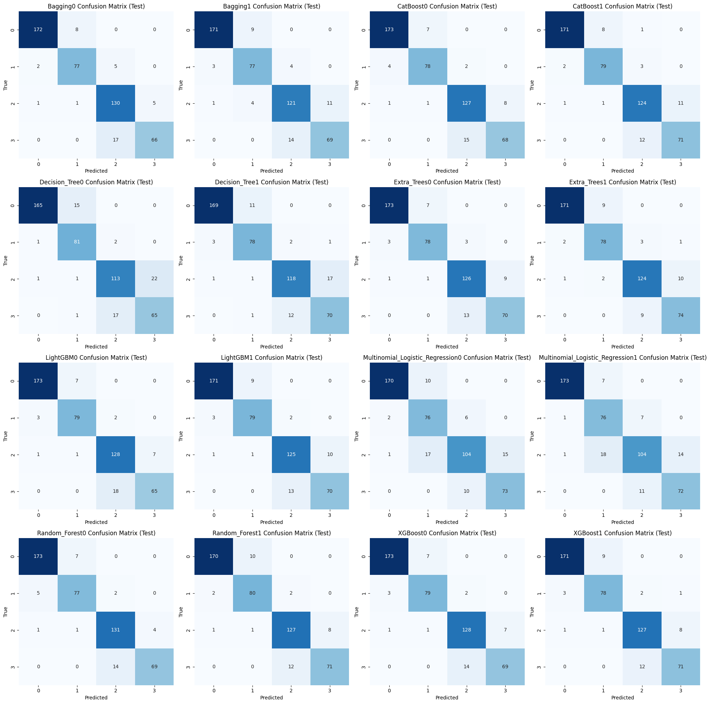

# CogniPredictAD
*Data Mining and Machine Learning, a.y. 2024/2025*

*Univeristy of Pisa,*
*Department of Information Engineering,*
*m.sc. Artificial Intelligence and Data Engineering*

*Project by Francesco Panattoni*

This report introduces CogniPredictAD, a *Data Mining and Machine Learning* project designed to analyze clinical and biological parameters from the ADNI dataset, with the goal of predicting final clinical diagnoses (CN, EMCI, LMCI, AD) based on baseline data.
The analysis includes a detailed examination of preprocessing techniques: missing data management, normalizations, and feature engineering. We assess the models based on their Macro F1 Score and present the results through various evaluations.
The modeling phase includes Decision Tree, Random Forest, Extra Trees, Adaptive Boosting and Multinomial Logistic Regression (with and without sampling on the dataset). Hybrid Sampling techniques, Grid Search for hyperparameter tuning, and cross-validation are applied. In the end the best performance is obtained by Extra Trees (without Hybrid Sampling) with Accuracy ≈ 0.9442, Macro F1 Score ≈ 0.9376, and ROC-AUC ≈ 0.9867.
We decided, for improving explainability, to also keep Decision Tree (it proved better with Hybrid Sampling) which has Accuracy ≈ 0.9153, Macro F1 Score ≈ 0.9055, and ROC-AUC ≈ 0.9773.
Due to the ambiguity of the high predictivity of three attributes (CDRSB, LDELTOTAL, mPACCdigit), I built two alternative models with the same pipeline as the main ones, but without those features.
The conclusions indicate strong predictive performance on the ADNIMERGE dataset but emphasize that potential sample bias and the absence of external validation limit clinical applicability. Additional patients to the dataset or through data integration with comparable datasets is required before any clinical use.


## Data Acquisition
All data required are available through [ADNI](https://adni.loni.usc.edu/) and the Image and Data Archive provided by the [Laboratory of Neuro Imaging](https://www.loni.usc.edu/) at the University of Southern California. To obtain access to data from ADNI, see this link: http://adni.loni.usc.edu/data-samples/access-data/

After getting Data access from the Alzheimer's Disease Neuroimaging Initiative (ADNI), place the ADNIMERGE.csv file in the *data* folder.


## Studies Cited in the Notebooks
### Notebook 2 (Data Preparation)
- [Race, Ethnicity, and Alzheimer's](https://aaic.alz.org/downloads2020/2020_Race_and_Ethnicity_Fact_Sheet.pdf)

### Notebook 3 (Data Exploration)
- [Cerebrospinal fluid and blood biomarkers in Alzheimer's disease](https://pmc.ncbi.nlm.nih.gov/articles/PMC3782169/)
- [Tau as a biomarker of neurodegenerative diseases](https://pmc.ncbi.nlm.nih.gov/articles/PMC2993973/)
- [Marriage and risk of dementia: systematic review and meta-analysis of observational studies](https://pubmed.ncbi.nlm.nih.gov/29183957/)
- [Marital status and risk of dementia over 18 years: Surprising findings from the National Alzheimer's Coordinating Center](https://pmc.ncbi.nlm.nih.gov/articles/PMC11923573/)
- [Contributions of the ADNI Biostatistics Core](https://alz-journals.onlinelibrary.wiley.com/doi/10.1002/alz.14159)

### Notebook 4 (Data Preprocessing)
- [Predicting clinical decline and conversion to Alzheimer's disease or dementia using novel Elecsys Aβ(1–42), pTau and tTau CSF immunoassays](https://www.nature.com/articles/s41598-019-54204-z)
- [Tau as a biomarker of neurodegenerative diseases](https://pmc.ncbi.nlm.nih.gov/articles/PMC2993973/)

### Notebook 5 (New Data Exploration)
- [Apolipoprotein E epsilon4 association with dementia in a population-based study: The Framingham study](https://pubmed.ncbi.nlm.nih.gov/8618665/)
- [Outlier detection with Local Outlier Factor (LOF)](https://scikit-learn.org/stable/auto_examples/neighbors/plot_lof_outlier_detection.html)

### Notebook 8 (Explainability)
- [Risk Score Stratification of Alzheimer's Disease and Mild Cognitive Impairment using Deep Learning](https://www.medrxiv.org/content/10.1101/2020.11.09.20226746v3.full)

## Installation
### With venv
```bash
cd CogniPredictAD
python -m venv CogniPredictAD
# On Linux/macOS:
source CogniPredictAD/bin/activate
# On Windows (PowerShell):
CogniPredictAD\Scripts\Activate.ps1
pip install --upgrade pip
pip install -e .
```

### With conda
```bash
cd CogniPredictAD
conda create --name CogniPredictAD python=3.11
conda activate CogniPredictAD
pip install --upgrade pip
pip install -e .
```

### Without venv and conda (Not recommended)
```bash
cd CogniPredictAD
pip install --upgrade pip
pip install -e .
```

## Folder Structure
- **data**: Contains the datasets used and generated. ADNIMERGE.csv (raw ADNI merge), ADNIMERGE_DICT.csv (variable dictionary), splits used in the experiment (train.csv, test.csv, pretrain.csv, pretest.csv, sampled.csv), and NEWADNIMERGE.csv (aggregated file with predictions/imputations produced by the pipeline). The notebook explicitly documents the creation and use of NEWADNIMERGE.csv;
- **doc**: LaTeX sources of the final report;
- **notebooks:** Collection of Jupyter notebooks that implement the entire flow. **The heart of the project is located in the *notebooks* folder. Most of the explanations and code are there, and I recommend reading them carefully to get a clear understanding of the project.** These include preliminary exploration (01), dataset preparation (02), data exploration (03), preprocessing (04), data exploration for classification (05), tuning (06), classifier training (07), explainability (08), model evaluation (09), and creation of operational models (10);
- **results**: Contains all the models produced. In particular, it contains the final models Model.pkl and AltModel.pkl and the interpretable models XAIModel.pkl and AltXAIModel.pkl;
- **src**: Reusable source code:
  - **classification** contains classifier.py and grid.py (ADNIClassifier class, functions for training, repeated CV, model saving, and evaluation);
  - **preprocessing** contains cleaner, transformer, KNN imputer, outlier handling, and attribute selection (all routines used to build train/test and fill missing values);
  - **visualization** contains explainer.py and visualizer.py (SHAP wrappers, permutation explainer, plotting, and tree/rule export). The rule export and tree rendering functions are implemented here.
- Root file (CogniPredictAD): Contains the main documents and the physician app in main.py.


## Introduction
Early and accurate diagnosis of **Alzheimer's disease** (AD) is a clinical and societal priority, enabling intervention before severe cognitive decline and supporting the timely planning of therapies, treatments, care strategies, and the evaluation of interventions aimed at slowing disease progression. However, the disease is complex and multifactorial: clinical signs, cognitive tests, cerebrospinal fluid (CSF) biomarkers, genetics (e.g. APOE4), and neuroimaging measures interact in a nontrivial way. For this reason, **Machine Learning** (ML) techniques are particularly well-suited: they can integrate multimodal information, model nonlinear relationships, and identify combinations of features that improve the discrimination between **cognitively normal** (CN), **mild cognitive impairment** (MCI), and full-blown **Alzheimer's subjects** (AD).

A dataset widely used in the literature for these purposes is **ADNI** (**Alzheimer's Disease Neuroimaging Initiative**), a multicenter longitudinal study that collects clinical, cognitive, genetic, CSF, and imaging data from USA and Canada. In this project, I worked with the **ADNIMERGE.csv** tabular file, which is the merged version of the ADNI data and contains repeated visits over time, many clinical variables, biomarkers, and metadata. The notebooks show the entire process of building classification models and their employment.

In this project, baseline visits were selected (from 16,421 rows to 2,419 rows), extensive cleaning and imputation of missing features was performed, MRI volumes were normalized for ICV, and derived features (biological ratios and cognitive scores) were constructed. Outlier Detection with IQR Method was used to spot errors.

The modeling compared trees and ensembles, using hyperparameter optimization and sampling strategies. The **Extra Trees** (without hybrid sampling) model was chosen as **Model**. The **Adaptive Boosting** (without hybrid sampling) model, chosen as **AltModel**, maintained good performance even when excluding the dominant features.

Furthermore, **XAIModel** and **AltXAIModel** represent the explainable Decision Trees for the dataset with and without the dominant features.

## Dataset
**ADNIMERGE.csv** is the **ADNI** merged table used as the main input in the notebooks: the copy used by the project contains 16,421 rows (representing visits) and 116 columns before any cleaning and selection, and incorporates repeat visits for each subject (VISCODE, EXAMDATE), identifiers (RID, PTID), and both the initial screening diagnosis (DX_bl) and the more complete diagnosis assigned at the visit (DX).

The structure is mixed but rich: there are demographics (AGE, PTGENDER, PTEDUCAT, PTETHCAT, PTRACCAT, PTMARRY), genetics (APOE4), numerous cognitive and clinical scores (MMSE, CDRSB, ADAS11/13, LDELTOTAL, FAQ, MOCA, TRABSCOR, RAVLT\_…, mPACC…), CSF and PET biomarkers (ABETA, TAU, PTAU, FDG, also columns such as PIB and AV45), and MRI volumetric measures (Ventricles, Hippocampus, Entorhinal, Fusiform, MidTemp, WholeBrain, ICV). Some features are related to a single visit, while others are repeated but refer to measurements taken during the baseline visit and end with the suffix "\_bl".

*ADNIMERGE.csv*, however, isn't simply a concatenation: many variables are derived from source files. For example, the variable Hippocampus is derived from the sum of the left/right components (ST29SV + ST88SV) taken from the original *FreeSurfer* files.


## Multiclass Problem
I have observed that the class distribution differs between DX_bl and DX
- **DX_bl** can be "CN", "SMC", "EMCI", "LMCI", and "AD". It indicates the screening diagnosis, i.e. the preliminary clinical judgment assigned during the first evaluation visit. It is a Screening diagnosis.
- **DX** can be "CN", "MCI", and "Dementia". It is instead the diagnosis assigned during the baseline visit (denoted by *VISCODE* equal to "bl"), after a more in-depth clinical evaluation.

"AD" and "Dementia" are the same thing despite the different names.

The acronym **SMC** refers to *Subjective Memory Concern*, i.e., cognitively normal (CN) subjects reporting perceived memory issues. Predicting a subjective perception from objective data is not meaningful. So I reassign it based on the value it has in DX.

Furthermore, I divided MCI into EMCI (Early MCI) and LMCI (Late MCI), assuming that DX_bl values accurately distinguish EMCI and LMCI when DX equals MCI. This is because the division into EMCI and LMCI reflects the degree of cognitive impairment and the risk of progression to dementia.
- **EMCI:** mild cognitive deficits, often detectable only with more sensitive tests. Lower or slower risk of progression to dementia.
- **LMCI:** more marked and evident impairment, greater impact on daily life. Higher risk of progression to Alzheimer's or other dementias.

Therefore, I decided to keep them in the diagnostic prediction.

<figure id="fig:pie-chart-dx" data-latex-placement="H">
<p>
<span id="fig:pie-chart-dx" data-label="fig:pie-chart-dx"></span></p>
</figure>

**Ultimately, our target variable will be a modified version of the *DX* column, which can now take on four values: "CN", "EMCI", "LMCI", and "AD." This makes our problem a multiclass problem. Hereafter, *DX* refers to this modified version.**


## Data Exploration
Explorations revealed that the dataset has 16,421 rows and 116 columns. However, these records represent the various visits, and I was only interested in the baseline ones. The dataset contains 2,419 useful patients (using "useful" means those who did not have a NULL baseline diagnosis) for the proposed problem.

Many columns contain significant percentages of missing cases. The diagnostic classes of the baseline sample are unbalanced, but not extremely unbalanced.

Demographic and risk analyses show bias in the ADNI sample. Ethnicity is heavily skewed toward white subjects, with high average levels of education, and many married individuals. There are more men than women, but overall the number is not disproportionate. All this, however, implies that models may perform worse on more heterogeneous clinical populations.

The *Data Exploration* was then divided into three parts:
1. the *preliminary data exploration* of the raw dataset;
2. the *data exploration* after splitting and preparing the actual learning set;
3. the *data exploration* after Preprocessing to select the classification models.

The *preliminary data exploration*'s descriptive summaries revealed extensive missing data, especially in key biomarker and imaging variables, prompting a structured missing-data plan. Review of baseline and visit fields confirmed usable *DX_bl* labels and clarified visit patterns, motivating a restriction to baseline records for classification.

In the *data exploration*, the training set was inspected using a reduced set of clinically relevant variables and derived ratios. MRI volumes were normalized by *ICV*, and CSF ratios *TAU/ABETA* and *PTAU/ABETA* were computed to improve biological interpretability and reduce scanner and size effects. Summary statistics, boxplots, and correlation maps were used to assess distributions and multicollinearity. Clinical and biomarker distributions showed the expected disease gradient but with strong overlap, skewness, and outliers. Sex differences in MRI volumes confirmed the need for ICV normalization. Class counts showed *only mild imbalance* across CN, EMCI, LMCI, and AD.

After preprocessing on the training set, I do a *new data exploration*. The final training file contained a compact multimodal set covering demographics, APOE4, cognition, Ecog, CSF ratios, and MRI/ICV ratios. Feature distributions were summarised using medians and IQRs. Outliers were assessed with **Local Outlier Factor** across clinical, CSF, MRI/ICV, and combined sets. Only a small number of high-anomaly cases emerged, many clinically plausible, supporting the use of models robust to skew and extreme values rather than broad exclusion.


## Learning Set
The **preparation phase** focused on isolating a coherent baseline cohort, restructuring the heterogeneous *ADNIMERGE.csv* into an analyzable form, and enforcing clinically sound data standards. The raw dataset, originally **visit–centric** and affected by extensive missingness, redundant attributes, and inconsistencies across ADNI phases, was reduced to a strictly **baseline-oriented structure** in which each participant contributes a single, diagnostically reliable record.

A first objective was to ensure diagnostic consistency. Screening and baseline labels were reconciled to guarantee that each subject possesses a unique and clinically valid baseline diagnosis. This step was essential for framing the downstream problem as a cross-sectional classification task. Demographic attributes were then harmonized: ethnicity and race were merged into a compact demographic descriptor, marital status was simplified into an informative binary form, and sex was encoded to support normalization and group comparisons. These operations provided a unified representation while preserving clinically relevant distinctions.

Attributes with overwhelming missingness or with limited value for single-visit modelling were removed. The retained variables concentrated on demographics, genetic risk, cognition, CSF biomarkers, and structural MRI measurements. Biomarker fields containing detection-limit symbols were converted into usable quantitative values, ensuring numerical compatibility without distorting their clinical meaning. Categorical labels exhibiting inconsistencies across ADNI phases were standardized to a homogeneous nomenclature.

A **systematic assessment of numerical plausibility** led to the identification of *outliers* that could not be justified clinically. Implausible values in cognitive tests and structural MRI volumes were marked for later imputation rather than corrected ad hoc, thereby **avoiding data leakage**.

After consolidation, the resulting dataset forms a compact **learning set** explicitly designed for multiclassification. The final structure is well aligned with the goals of diagnostic modelling: it is coherent, interpretable, statistically stable, and it supports principled preprocessing steps. At the end I used the **Holdout Method** to split the data into 80% for the training set and 20% for the testing set. 


## Data Preprocessing
The **Preprocessing phase** reshaped the learning set into a modelling-ready multiclass table by applying **structured imputation**, **biologically informed transformations**, **feature reduction**, and **controlled class balancing**. The objective was to obtain a compact, coherent, and statistically stable representation suitable for diagnostic classification.

### Cleaning and Imputation
Missingness was evaluated across modalities. Continuous and discrete gaps were imputed using a **K-Nearest Neighbors-based** strategy that preserved local structure and maintained integer semantics where appropriate. This procedure ensured numerical coherence while avoiding distortions in clinically sensitive variables.

### Transformations and Normalizations
Two families of transformations were central:

- **CSF biomarkers** were expressed as the ratios **TAU/ABETA** and **PTAU/ABETA**, which were calculated to enhance biological interpretability and provide more diagnostically meaningful measures than the raw values;

- Structural **MRI measures** were **normalized** by **intracranial volume** (**ICV**), yielding relative regional volumes that are comparable across individuals and less affected by head-size confounds.

Furthermore, **demographic and categorical predictors** were **encoded** into low-cardinality representations to enhance interpretability and compatibility with tabular models.

### Feature Reduction and Selection
Redundant or low-information variables were removed through a combination of statistical and conceptual criteria. Highly overlapping cognitive scales were consolidated: **ADAS11** and **ADASQ4** were **discarded** in favour of **ADAS13**, which subsumes their information almost entirely. **Global Ecog scores were removed**, while the domain-specific components were retained for their finer discriminative value. When two composite scores were strongly correlated, the version with greater mutual information regarding diagnosis was preferred. Demographic attributes with negligible variability were excluded to avoid noise and spurious effects.

### Class Balancing
To address the residual **class imbalance**, a **hybrid sampling pipeline** was implemented. **Majority classes** were modestly **under-sampled** with **Random Undersampler**, while **minority classes** were synthetically **oversampled** using **SMOTENC**, which preserves mixed continuous–categorical structure. All diagnostic groups (**DX**) were brought to comparable sample sizes, producing a balanced dataset suitable for unbiased model comparison. 

### Some Considerations
#### Correlation
The dataset contains groups of highly correlated variables (e.g., different neuropsychological scores, ECG components, and MRI volumetric measurements). Rather than eliminating them through aggressive reduction, I decided to retain them and rely on models that are intrinsically robust to correlation.
This choice was motivated by two main reasons:
1.  **Clinical interpretability:** Correlated variables can describe different facets of the same function or biomarker. Removing them would impoverish medical interpretation;
2.  **Complementary predictive value:** Even correlated measures may contain specific variance useful for distinguishing clinical subgroups.

#### Normalization
During the data preprocessing process, no global normalization or standardization was applied to all variables.
This choice was driven by one reason: I wanted to **preserve the clinical interpretability**. Maintaining variables in their original units facilitates the medical interpretation of the results and comparability with clinical reference values. Normalization would have made it more difficult to attribute direct clinical significance to the transformed values.

#### Binning
Binning was not applied because it would have reduced the useful information and discriminatory power of continuous variables. The models used already capture nonlinearities and thresholds, so prior discretization is unnecessary and could introduce artifacts.

### Final Dataset
The resulting dataset contains a focused and interpretable feature set spanning demographic characteristics, genetic risk, cognitive performance, functional assessments, CSF ratios, and ICV-normalized MRI measures. Its structure is explicitly tailored for multiclass diagnostic modelling, reducing redundancy while retaining clinically meaningful variability.

The preprocessing decisions emphasise interpretability, biological plausibility, robustness to noise, and balanced class representation. These principles ensure that the subsequent modelling pipeline operates on data that are both statistically reliable and clinically coherent.

#### Attributes Table
| **Attribute** | **Description** | **Category** |
|:---|:---|:---|
| DX | Clinical diagnosis at the time of visit: CN, EMCI, LMCI, AD | Diagnosis |
| AGE | Participant's age at time of visit | Demographics |
| PTGENDER | Participant's gender (Male/Female) | Demographics |
| PTEDUCAT | Years of formal education completed | Demographics |
| APOE4 | Number of APOE *ε*<!-- -->4 alleles (0, 1, or 2), a genetic risk factor for Alzheimer's | Demographics |
| MMSE | Mini-Mental State Examination score (0–30, higher = better) | Clinical Scores |
| CDRSB | Clinical Dementia Rating - Sum of Boxes (0–18, higher = worse) | Clinical Scores |
| ADAS13 | ADAS-Cog 13-item total score (higher = worse) | Clinical Scores |
| LDELTOTAL | Logical Memory II delayed recall total score | Clinical Scores |
| FAQ | Functional Activities Questionnaire – functional impairment score | Clinical Scores |
| MOCA | Montreal Cognitive Assessment – global cognitive function (0–30) | Clinical Scores |
| TRABSCOR | Trail Making Test Part B – time in seconds (higher = worse) | Clinical Scores |
| RAVLT_immediate | RAVLT total immediate recall score (sum over 5 trials) | Clinical Scores |
| RAVLT_learning | Learning score (Trial 5 minus Trial 1 of RAVLT) | Clinical Scores |
| RAVLT_perc_forgetting |   Percent forgetting from RAVLT (higher = worse) | Clinical Scores |
| mPACCdigit | Modified Preclinical Alzheimer's Cognitive Composite – Digit Symbol test | Composite Scores |
| EcogPtMem | Subject self-reported memory complaints (ECog) | ECogPT |
| EcogPtLang | Subject self-reported language difficulties (ECog) | ECogPT |
| EcogPtVisspat | Subject self-reported visuospatial difficulties (ECog) | ECogPT |
| EcogPtPlan | Subject self-reported planning difficulties (ECog) | ECogPT |
| EcogPtOrgan | Subject self-reported organizational issues (ECog) | ECogPT |
| EcogPtDivatt | Subject self-reported divided attention issues (ECog) | ECogPT |
| EcogSPMem | Informant-reported memory complaints (ECog) | ECogSP |
| EcogSPLang | Informant-reported language issues (ECog) | ECogSP |
| EcogSPVisspat | Informant-reported visuospatial issues (ECog) | ECogSP |
| EcogSPPlan | Informant-reported planning problems (ECog) | ECogSP |
| EcogSPOrgan | Informant-reported organization issues (ECog) | ECogSP |
| EcogSPDivatt | Informant-reported divided attention issues (ECog) | ECogSP |
| FDG | FDG PET SUVR – brain glucose metabolism | Biomarkers |
| TAU/ABETA | CSF tau protein/A*β*<!-- -->42 ratio | Biomarkers |
| PTAU/ABETA | CSF phosphorylated tau protein/A*β*<!-- -->42 ratio | Biomarkers |
| Hippocampus/ICV | Volume of hippocampus/Intracranial volume ratio from MRI | MRI |
| Entorhinal/ICV | Volume of the entorhinal cortex/Intracranial volume ratio from MRI | MRI |
| Fusiform/ICV | Fusiform gyrus volume/Intracranial volume ratio from MRI | MRI |
| MidTemp/ICV | Middle temporal gyrus volume/Intracranial volume ratio from MRI | MRI |
| Ventricles/ICV | Volume of ventricles/Intracranial volume ratio from MRI | MRI |
| WholeBrain/ICV | Whole brain volume/Intracranial volume ratio from MRI | MRI |


## Model Selection
The following classification algorithms were chosen:
1.  **Decision Tree:** This model constructs a series of "if → then" rules (split on individual features) to separate classes using a binary tree. Each leaf of the tree corresponds to a prediction. It was chosen because it is immediately interpretable (*XAI*);
2.  **Random Forest:** Builds many different decision trees on subsamples of the data and averages their predictions. This reduces variance compared to a single tree and improves robustness to noise, outliers, and collinearity;
3.  **Extra Trees:** Similar to Random Forest but chooses more random splits, increasing diversity among trees and often reducing overfitting on noisy features. It was tested to compare with Random Forest and evaluate whether increased randomness improved generalization across the dataset;
4.  **Adaptive Boosting:** A boosting algorithm (AdaBoost) that builds a strong classifier by combining many weak learners (decision trees). It iteratively reweights training samples, increasing the weight of those misclassified by previous learners so that subsequent models focus on harder examples. Each weak learner is also given a weight based on its accuracy, and the final prediction is a weighted vote (or sum) of all learners. It tends to reduce bias and can generalize well, though it may be sensitive to noisy data and outliers;
5.  **Multinomial Logistic Regression:** A linear model that estimates the probabilities of membership in each class using a linear combination of features. It requires feature standardization to function properly, which was ensured with a Standard Scaler in the pipeline. It was included as a simple and interpretable statistical baseline, useful for comparing whether the gain from complex models is consistent with a linear solution.


## Hyperparameter Tuning
Each **classification algorithm** is **embedded** in a **pipeline** that handles **preprocessing**. We have created an additional pipeline with a **rebalancing strategy** combining **Random Under Sampler** for **majority classes** and **SMOTENC** for **minority ones**. Categorical indices for SMOTENC are explicitly computed relative to *PTGENDER* and *APOE4*.

To optimize the performance of the classifiers, the **hyperparameter tuning** is carried out through exhaustive **Grid Search** with **5-fold cross-validation**. The chosen metric is the **macro-averaged F1 score**, an appropriate criterion when class imbalance is present and when resampling modifies the empirical class distribution. *Macro F1* is a stable metric that directly exposes failures on minority classes while avoiding dominance by majority-class performance. 

The **parameter grids** explore regularisation strength for logistic regression, depth and leaf-size constraints for tree-based models, and learning-rate and estimator settings for boosting. The grid search function returns, for each classifier, the optimal configuration and the corresponding cross-validated scores.

*Without sampling*, the preferred configurations include: entropy-based decision trees with pruning (ccp_alpha = 0.005), random forests with moderate depth (max_depth = 6) and a relatively small leaf size, and extra-trees models with unrestricted depth but non-trivial leaf constraints. Logistic regression settles on an *ℓ*<sub>1</sub> penalty with smaller *C* values, confirming the advantage of sparsity for this dataset.

When *sampling* is introduced, the resulting configurations remain close to the unsampled ones, showing robustness of the underlying modelling assumptions. Random forests and extra-trees select nearly identical depths and feature constraints, whereas logistic regression increases *C* slightly to account for the modified class distribution.

At the end of the Grid Search, the optimal parameters found for each model were used to instantiate the "final" versions of the classifiers and produce subsequent evaluations.


## Classification
### Building Models
From the **Grid Search**, the **best estimators**, their **parameters**, and **scores** were collected for each **model**. These best-estimators were saved, then retrained and evaluated using **5-fold cross-validation**, producing several outputs: confusion matrices, per-class metrics, macro F1 score, accuracy, ROC-AUC, and repeated evaluations to assess stability.

Cross-validated rankings indicate that ensemble methods are top performers, with only small margins separating them: adaptive boosting, random forest, and extra trees show nearly equivalent CV performance. Logistic regression and shallow, un-sampled decision trees lag behind on macro F1.

Pairwise statistical comparison across CV folds was performed using the **Wilcoxon signed-rank test** on model F1_macro scores to determine whether observed differences were reproducible. The results show many non-significant comparisons and a minority with *p*-values below conventional thresholds. Specifically, twelve pairwise comparisons yielded *p* \< 0.05, while numerous others returned *p* ≥ 0.05, several exceeding *p* = 0.2, and many near or above *p* = 0.5. The smallest observed *p*-values are on the order of 1 × 10<sup>−3</sup>, indicating a few consistent differences across CV folds.

**However, where *p* \< 0.05, the differences in macro F1 are small, implying negligible practical effect despite statistical significance.** Thus, Wilcoxon analysis suggests that CV ranking alone is insufficient for definitive model selection, and an independent evaluation on the test set is required to determine the best model.

### Explainability
SHAP summary plots were generated for each model.

**CDRSB, LDELTOTAL, and mPACCdigit dominate the feature explanations.** SHAP plots reveal these features as the most important in absolute terms, far above other features. The plots also show that the direction of effect is consistent: worse values for these scores bias predictions toward more severe classes, whereas higher LDELTOTAL and mPACCdigit push predictions toward cognitively normal status.

SHAP point-clouds demonstrate consistent sign and concentration across ensemble and tree models, producing clear decision rules in unambiguous cases but fragility when these features are missing, noisy, or cohort-specific.

Sampling distributes importance to secondary predictors (e.g., hippocampus/ICV ratios and Ecog measures), generating deeper trees with lower node purity, which tend to generalize better under class-balancing interventions.

Decision tree diagrams and exported rule files show that class separation typically relies on thresholds of a few key features (often one of the three clinical scores, or combinations of biomarkers and cognitive tests). The resulting rules are easily interpretable and suitable for communicating "if → then" statements to clinical staff.

### Results
Models were evaluated on the training set, 5-fold CV, and the testing set. The final evaluation focused primarily on explainability and test set results, including: *F1 Score (macro), Accuracy, Balanced Accuracy, Precision (weighted), Recall (weighted), F1 Score (weighted), and ROC AUC (macro)*. Evaluation plots and confusion matrices are included in the following section alongside evaluation tables for the test set.

An Extra Trees classifier trained without hybrid sampling (`Extra_Trees`) achieved the best test performance: a **macro F1 ≈ 0.9376**, **accuracy ≈ 0.9442**, and **ROC AUC ≈ 0.9867**.

As a complementary explainable model (`XAIModel`), a decision tree trained with sampling (`Decision_Tree_Sampled`) was selected for improved generalization and concise rule-based outputs. Both primary and XAI models, including exported rules and tree diagrams, are available in the results directory.

### The Problem with CDRSB, LDELTOTAL, and mPACCdigit
As shown in the explainability section, the cognitive scores *CDRSB*, *LDELTOTAL*, and *mPACCdigit* exhibit exceptionally high predictive power.

While this improves model accuracy, it raises a concern of feature dominance: **a small number of variables may disproportionately drive predictions, while many others contribute minimally**, potentially leading to local overfitting. Models may appear highly effective on the ADNI dataset but lose performance on more heterogeneous populations or external data.

**However, these three variables may genuinely be strong predictors of Alzheimer's diagnosis.** The issue may reflect dataset bias rather than a flaw in the cognitive measures themselves.

To test this, classifiers were retrained with leakage-free preprocessing and CV, omitting CDRSB, LDELTOTAL, and mPACCdigit. Both unsampled and hybrid-sampled variants were evaluated via exhaustive grid search. The removal reduced discriminative power but retained sufficient signal for meaningful model comparison.

Feature-attribution analyses (permutation importance and SHAP) showed a reconfiguration of the predictive hierarchy: ADAS13, MMSE, FAQ, and RAVLT scores became leading predictors, while structural MRI ratios (Hippocampus/ICV, Entorhinal/ICV, Fusiform/ICV, Ventricles/ICV), CSF ratios (TAU/ABETA, PTAU/ABETA), and FDG PET measures assumed secondary roles. Sampling mitigated single-feature dominance and produced deeper, lower-purity trees, enhancing interpretability of non-dominant signals but reducing overall predictive ceiling.

Performance metrics reflect the expected drop: the best alternative model was an Adaptive Boosting ensemble (macro F1 ≈ 0.7303, accuracy ≈ 0.7459, macro ROC AUC ≈ 0.9037). Pairwise Wilcoxon tests showed few significant differences, and effect sizes were small, highlighting that statistical significance does not always indicate practical superiority.

- The system remains usable without the dominant cognitive measures if remaining cognitive and functional assessments are reliably collected.

- Ensemble models continue to offer the best discrimination, while sampled shallow trees provide a defensible, interpretable fallback.

### Tables and Images
<figure id="fig:Evaluation with CDRSB, LDELTOTAL, and mPACCdigit" data-latex-placement="H">
<p>
<span id="fig:Evaluation with CDRSB, LDELTOTAL, and mPACCdigit" data-label="fig:Evaluation with CDRSB, LDELTOTAL, and mPACCdigit"></span></p>
<figcaption>Evaluation of Balanced Accuracies with CDRSB, LDELTOTAL, and mPACCdigit (from folder results/all_models/1)</figcaption>
</figure>

<figure id="fig:Evaluation without CDRSB, LDELTOTAL, and mPACCdigit" data-latex-placement="H">
<p>
<span id="fig:Evaluation without CDRSB, LDELTOTAL, and mPACCdigit" data-label="fig:Evaluation without CDRSB, LDELTOTAL, and mPACCdigit"></span></p>
<figcaption>Evaluation of Balanced Accuracies without CDRSB, LDELTOTAL, and mPACCdigit (from folder results/all_models/2)</figcaption>
</figure>

<figure id="fig:Confusion Matrix with CDRSB, LDELTOTAL, and mPACCdigit" data-latex-placement="H">
<p>
<span id="fig:Confusion Matrix with CDRSB, LDELTOTAL, and mPACCdigit" data-label="fig:Confusion Matrix with CDRSB, LDELTOTAL, and mPACCdigit"></span></p>
<figcaption>Confusion Matrix with CDRSB, LDELTOTAL, and mPACCdigit (from folder results/all_models/1)</figcaption>
</figure>

<figure id="fig:Normalized Confusion Matrix with CDRSB, LDELTOTAL, and mPACCdigit" data-latex-placement="H">
<p>
<span id="fig:Normalized Confusion Matrix with CDRSB, LDELTOTAL, and mPACCdigit" data-label="fig:Normalized Confusion Matrix with CDRSB, LDELTOTAL, and mPACCdigit"></span></p>
<figcaption>Normalized Confusion Matrix with CDRSB, LDELTOTAL, and mPACCdigit (from folder results/all_models/1)</figcaption>
</figure>

<figure id="fig:Confusion Matrix without CDRSB, LDELTOTAL, and mPACCdigit" data-latex-placement="H">
<p>
<span id="fig:Confusion Matrix without CDRSB, LDELTOTAL, and mPACCdigit" data-label="fig:Confusion Matrix without CDRSB, LDELTOTAL, and mPACCdigit"></span></p>
<figcaption>Confusion Matrix without CDRSB, LDELTOTAL, and mPACCdigit (from folder results/all_models/2)</figcaption>
</figure>

<figure id="fig:Normalized Confusion Matrix without CDRSB, LDELTOTAL, and mPACCdigit" data-latex-placement="H">
<p>
<span id="fig:Normalized Confusion Matrix without CDRSB, LDELTOTAL, and mPACCdigit" data-label="fig:Normalized Confusion Matrix without CDRSB, LDELTOTAL, and mPACCdigit"></span></p>
<figcaption>Normalized Confusion Matrix without CDRSB, LDELTOTAL, and mPACCdigit (from folder results/all_models/2)</figcaption>
</figure>

*M_L_R is for Multinomial_Logistic_Regression.*

**With CDRSB, LDELTOTAL, and mPACCdigit (from folder results/all_models)**
| Model                     | F1 Score (macro) | Accuracy | Balanced Accuracy | Precision (weighted) | Recall (weighted) | F1 Score (weighted) | ROC AUC (macro) |
| ------------------------- | ---------------- | -------- | ----------------- | -------------------- | ----------------- | ------------------- | --------------- |
| Extra_Trees               | 0.9376           | 0.9442   | 0.9408            | 0.9448               | 0.9442            | 0.9443              | 0.9867          |
| Extra_Trees_Sampled       | 0.9359           | 0.9421   | 0.9411            | 0.9435               | 0.9421            | 0.9425              | 0.9890          |
| Random_Forest             | 0.9301           | 0.9380   | 0.9341            | 0.9387               | 0.9380            | 0.9381              | 0.9886          |
| Adaptive_Boosting         | 0.9285           | 0.9360   | 0.9347            | 0.9378               | 0.9360            | 0.9363              | 0.9878          |
| Random_Forest_Sampled     | 0.9271           | 0.9339   | 0.9358            | 0.9367               | 0.9339            | 0.9344              | 0.9863          |
| Adaptive_Boosting_Sampled | 0.9262           | 0.9339   | 0.9329            | 0.9361               | 0.9339            | 0.9343              | 0.9890          |
| Decision_Tree_Sampled     | 0.9131           | 0.9236   | 0.9178            | 0.9244               | 0.9236            | 0.9235              | 0.9804          |
| Decision_Tree             | 0.8934           | 0.9050   | 0.9026            | 0.9096               | 0.9050            | 0.9057              | 0.9824          |
| M_L_R                     | 0.8700           | 0.8843   | 0.8816            | 0.8893               | 0.8843            | 0.8843              | 0.9825          |
| M_L_R_Sampled             | 0.8677           | 0.8822   | 0.8754            | 0.8851               | 0.8822            | 0.8826              | 0.9827          |


**Without CDRSB, LDELTOTAL, and mPACCdigit (from folder results/all_models/alternative)**
| Model                     | F1 Score (macro) | Accuracy | Balanced Accuracy | Precision (weighted) | Recall (weighted) | F1 Score (weighted) | ROC AUC (macro) |
| ------------------------- | ---------------- | -------- | ----------------- | -------------------- | ----------------- | ------------------- | --------------- |
| Adaptive_Boosting         | 0.7303           | 0.7459   | 0.7327            | 0.7456               | 0.7459            | 0.7437              | 0.9037          |
| Adaptive_Boosting_Sampled | 0.7112           | 0.7293   | 0.7157            | 0.7316               | 0.7293            | 0.7277              | 0.9001          |
| Random_Forest             | 0.7061           | 0.7252   | 0.7052            | 0.7256               | 0.7252            | 0.7245              | 0.9022          |
| Random_Forest_Sampled     | 0.7035           | 0.7190   | 0.7050            | 0.7251               | 0.7190            | 0.7208              | 0.9041          |
| Extra_Trees_Sampled       | 0.7011           | 0.7211   | 0.7075            | 0.7258               | 0.7211            | 0.7202              | 0.9003          |
| Extra_Trees               | 0.6998           | 0.7293   | 0.6952            | 0.7215               | 0.7293            | 0.7238              | 0.9105          |
| M_L_R_Sampled             | 0.6829           | 0.7066   | 0.6933            | 0.7135               | 0.7066            | 0.7063              | 0.8921          |
| M_L_R                     | 0.6768           | 0.7004   | 0.6882            | 0.7055               | 0.7004            | 0.6996              | 0.8952          |
| Decision_Tree             | 0.6603           | 0.6632   | 0.6622            | 0.6960               | 0.6632            | 0.6736              | 0.8467          |
| Decision_Tree_Sampled     | 0.6482           | 0.6508   | 0.6543            | 0.6990               | 0.6508            | 0.6626              | 0.8445          |


### Final Decision
***Extra_Trees*** (trained without hybrid sampling) was chosen as the main model, and ***Decision_Tree_Sampled*** (trained with sampling) as the XAI reference. This selection is based on superior test metrics, balancing class sensitivity.

**Model.pkl and XAIModel.pkl correspond to Extra_Trees and Decision_Tree_Sampled, respectively.**

For the dataset excluding the three cognitive scores, the best-performing model was ***Adaptive Boosting*** (unsampled), with ***Decision_Tree*** as the XAI reference.

**AltModel.pkl and AltXAIModel.pkl correspond to Adaptive_Boosting and Decision_Tree in the alternative folder.**

### Comparison with the State of the Art
The ADNIMERGE.csv file is widely used in the scientific literature, with hundreds of studies explicitly citing it as the source of ADNI tabular data. Despite this, I have not come across many studies that have formulated the problem as a multiclass classification with the four labels CN, EMCI, LMCI, and AD. Most machine learning models proposed in the literature focus on binary tasks, such as CN vs. AD, CN vs. MCI, or MCI vs. AD. However, it is still possible to propose a comparison with the state of the art starting from these experimental settings.

Our results in short:

| Model Name  | F1 Score (macro) | Accuracy | ROC AUC (macro) |
| ----------- | ---------------- | -------- | --------------- |
| Model       | 0.9376           | 0.9442   | 0.9867          |
| XAIModel    | 0.9131           | 0.9236   | 0.9804          |
| AltModel    | 0.7303           | 0.7459   | 0.9037          |
| AltXAIModel | 0.6602           | 0.6632   | 0.8467          |

- [Kauppi et al. (medRxiv, 2020)](https://www.medrxiv.org/content/10.1101/2020.11.09.20226746v3): Deep-learning risk-scoring pipeline using selected neurocognitive tests, achieving multiclass *A**U**C* ≈ 0.984.
- [Alatrany et al. (Scientific Reports, 2024)](https://www.nature.com/articles/s41598-024-51985-w): Multimodal, explainability-oriented approach on NACC. SVM reaches multiclass *F*1 ≈ 90.7%. **Note that the data source (NACC vs. ADNI) and feature set are not directly comparable.**
- [Cuingnet et al. (NeuroImage, 2010)](https://adni.loni.usc.edu/adni-publications/Cuingnet_Neuroimage_2010-1.pdf): Historical ADNI benchmark (MRI-based). Multiclass performance typically 70–90% accuracy, lower than binary tasks.

Model is competitive with these works, AltModel favors robustness over dominant features, and XAIModels illustrate the trade-off between interpretability and accuracy. Model cannot be claimed superior without identical splits/preprocessing or formal statistical tests.


## Conclusions
### Real World Applications
A CogniPredictAD application (in app.py) has been developed with customtkinter that allows you to select one of four previously saved models (**Model.pkl**, **XAIModel.pkl**, **AltModel.pkl**, and **AltXAIModel.pkl**), manually enter a set of clinical and cognitive measures, obtain a diagnostic prediction (labels CN, EMCI, LMCI, and AD), and display it. The user can confirm or dispute the diagnosis: both actions add a line to the data/NEWADNIMERGE.csv file (creating a folder/file if necessary), while an "Undo Last" command cancels the last saved entry. This application can be used by clinicians to collect data, evaluate prediction models, and ultimately help establish a diagnosis.

### Final Considerations
One of the main limitations of the dataset is that, after filtering for baseline visits with non-zero diagnoses, only 2,419 patients remain, a size that limits the ability to generalize the results to external populations. While these metrics showed very high performance on the test set (for **Model.pkl**: Accuracy = 0.9442, F1 macro = 0.9376, ROC AUC (macro) = 0.9867), these metrics should be interpreted with caution.

Furthermore, three cognitive scores (CDRSB, LDELTOTAL, and mPACCdigit) provide a very strong diagnostic signal in this dataset: their presence largely explains the high effectiveness of **Model.pkl** (Extra Trees), while their removal leads to significantly lower metrics and a different distribution of important features, with Adaoost proving to be the best classifier in the pipeline without these variables. For these reasons, interpretable models (XAIModel and AltXAIModel) and an alternative pipeline (AltModel and AltXAIModel) that exclude the three scores were developed to assess the robustness and clinical plausibility of the predictions.

Many columns have missing values, and the missingness pattern is often not *MCAR* (Missing Completely At Random). In fact, CSF and PET values are more often missing in healthy subjects or at certain visits. For example, *ABETA*, *TAU*, and *PTAU* have many missing values and are not so irrelevant in the diagnosis of Alzheimer's disease. This forces us to impute *NULL* values and potentially increase noise in the dataset.

Despite size limitations, the reliance on a few highly predictive cognitive scores, and the large amount of *NULL* values, the study retains methodological value and potential for application. The models can be useful as support tools (for example, risk stratification, imputation of missing diagnoses, or prioritized screening), not as a substitute for clinical assessment. Their use must be subject to external validation, calibration of the operating thresholds and post-deploy monitoring.

### Improvements for Future Works
To improve the study, increasing the size and variability of the data is a priority: integrating future ADNI4 entries into ADNIMERGE and, if possible, compatible external cohorts would increase statistical power and generalizability.

In this context, we could also introduce a new feature that identifies patients based on their geographic area of origin. Since ADNI participants are from the United States and Canada, their area would be classified as North America. If, for example, we were able to integrate a European dataset compatible with ADNI for predicting Alzheimer's disease, we could analyze whether geographic area affects the likelihood of developing the disease. This approach could open the way to new and interesting lines of research.

It is also essential to harmonize the variables (mapping and units for imaging) and enrich the database with complementary modalities (genetics, PET, blood biomarkers) and longitudinal information, thus reducing reliance on a few cognitive scores. 

Additionally, implementing a **Neural-Network pipeline** would provide a valuable benchmark against the traditional algorithms used here. A practical approach is to start with a fully connected network for tabular inputs (standardized features, embedding layers for categoricals, dropout and batch-normalization) and to extend to modality-specific architectures where appropriate (CNN backbones for imaging, LSTM/GRU or Transformer encoders for longitudinal series) with a late fusion layer for multimodal integration. Train with class-weighted loss or focal loss and balanced/stratified minibatches to address label imbalance, use nested cross-validation, early stopping and learning-rate schedulers for robust model selection, and apply calibration (e.g. temperature scaling) before clinical use.

*However, CogniPredictAD is already a good support tool for doctors in helping with the diagnosis of Alzheimer's.*


